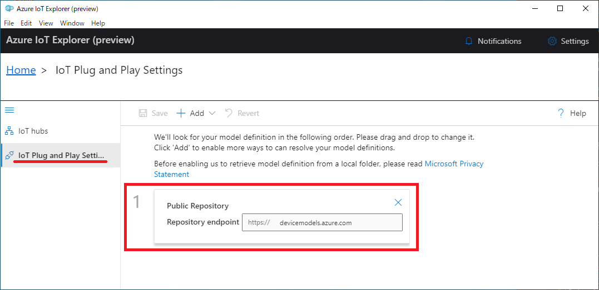
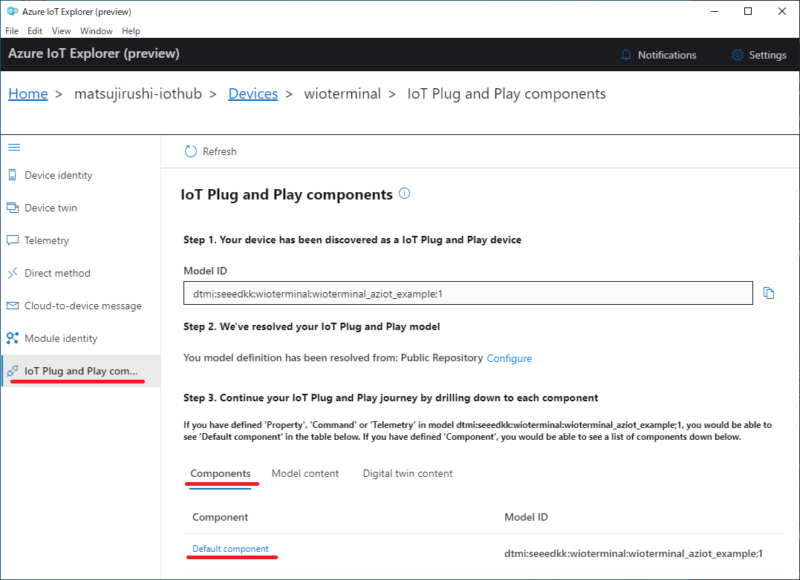
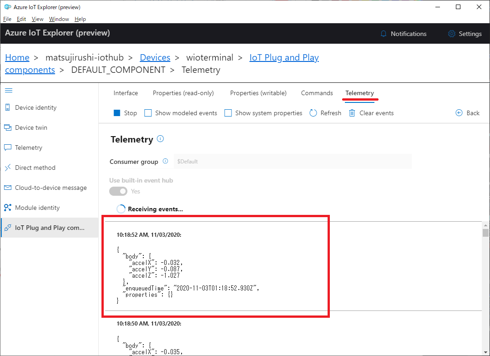
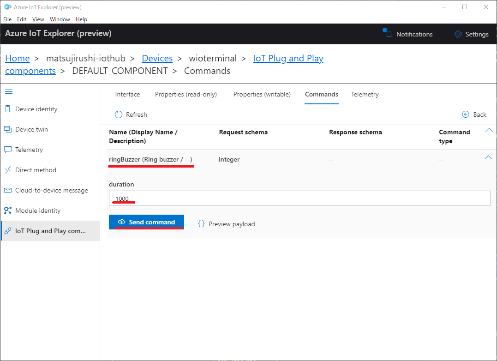

Connect Wio Terminal device to your Azure IoT services
===

---
# Table of Contents

-   [Introduction](#Introduction)
-   [Supported Device Attestation Methods](#SupportedDeviceAttestationMethods)
-   [Prerequisites](#Prerequisites)
-   [Prepare the Device](#preparethedevice)
-   [Connect to Azure IoT](#ConnecttoAzureIoT)
-   [Integration with Azure IoT Explorer](#IntegrationwithAzureIoTExplorer)
-   [Additional Links](#AdditionalLinks)

<a name="Introduction"></a>
# Introduction 

This document describes how to connect Wio Terminal to Azure IoT Hub using the Azure IoT Explorer with certified device application and device models.

IoT Plug and Play certified device simplifies the process of building devices without custom device code. Using Solution builders can integrated quickly using the certified IoT Plug and Play enabled device based on Azure IoT Central as well as third-party solutions.

This getting started guide provides step by step instruction on getting the device provisioned to Azure IoT Hub using Device Provisioning Service (DPS) and using Azure IoT Explorer to interact with device's capabilities.

The Wio Terminal is a SAMD51-based microcontroller with Wireless Connectivity supported by Realtek RTL8720DN that’s compatible with Arduino and MicroPython. It runs at 120MHz (Boost up to 200MHz), 4MB External Flash and 192KB RAM. It supports both Bluetooth and Wi-Fi providing backbone for IoT projects. The Wio Terminal itself is equipped with a 2.4” LCD Screen, onboard IMU(LIS3DHTR), Microphone, Buzzer, microSD card slot, Light sensor, and Infrared Emitter(IR 940nm). On top of that, it also has two multifunctional Grove ports for Grove Ecosystem and 40 Raspberry Pi compatible pin GPIO for more add-ons.

* Highly Integrated Design
  * MCU, LCD, WIFI, BT, IMU, Microphone, Speaker, microSD Card, Light Sensor, 5-Way Switch, Infrared Emitter (IR 940nm), Crypto-authentication Ready
* Powered by Microchip ATSAMD51P19
  * ARM Cortex-M4F core running at 120MHz(Boost up to 200MHz)
  * 4 MB External Flash, 192 KB RAM
* Comprehensive Protocol Support
  * SPI, I2C, I2S, ADC, DAC, PWM, UART(Serial)
* Powerful Wireless Connectivity
  * Powered by Realtek RTL8720DN
  * Dual Band 2.4Ghz / 5Ghz Wi-Fi (802.11 a/b/g/n)
  * BLE / BLE 5.0
* USB OTG Support
  * USB Host
  * USB Client
* Grove Ecosystem
* Software Support
  * Arduino
  * MicroPython
  * ArduPy
  * AT Firmware

To learn more, visit Wio Terminal product page.

* [Wio Terminal @shop](https://www.seeedstudio.com/Wio-Terminal-p-4509.html)
* [Wio Terminal @wiki](https://wiki.seeedstudio.com/Wio-Terminal-Getting-Started/)

<a name="SupportedDeviceAttestationMethods"></a>
# Supported Device Attestation Methods

The following table summarizes supported device attestation/authentication methods :

| Service           | Enrollment | Authentication           | Support status |
|:------------------|:-----------|:-------------------------|:---------------|
| Azure IoT Hub     | -          | Symmetric Key            | Need recompile |
| Azure IoT Hub     | -          | X.509 Self-Signed        | Not Supported  |
| Azure IoT Hub     | -          | X.509 CA-Signed          | Not Supported  |
| Azure IoT Hub DPS | Group      | Symmetric Key            | **Supported** |
| Azure IoT Hub DPS | Group      | CA Certificate           | Not Supported  |
| Azure IoT Hub DPS | Group      | Intermediate Certificate | Not Supported  |
| Azure IoT Hub DPS | Individual | Symmetric Key            | **Supported** |
| Azure IoT Hub DPS | Individual | X.509                    | Not Supported  |
| Azure IoT Hub DPS | Individual | TPM                      | Not Supported  |
| Azure IoT Central | Group      | Symmetric Key            | **Supported** |
| Azure IoT Central | Group      | CA Certificate           | Not Supported  |

<a name="Prerequisites"></a>
# Prerequisites

You should have the following items ready before beginning the process:

**For Azure IoT Central**
-   [Azure Account](https://portal.azure.com)
-   [Azure IoT Central application](https://apps.azureiotcentral.com/)

**For Azure IoT Hub**
-   [Azure IoT Hub Instance](https://docs.microsoft.com/en-us/azure/iot-hub/about-iot-hub)
-   [Azure IoT Hub Device Provisioning Service](https://docs.microsoft.com/en-us/azure/iot-dps/quick-setup-auto-provision)
-   [Azure IoT Public Model Repository](https://docs.microsoft.com/en-us/azure/iot-pnp/concepts-model-repository)

<a name="preparethedevice"></a>
# Prepare the Device

In order to configure WiFi and Azure IoT device authentication, please install a serial terminal application such as Putty.
Wio Terminal uses a serial console command line tool to configure network and Azure IoT provisioning information.

[A game application](https://wiki.seeedstudio.com/Wio-Terminal-Firmware/) is pre-installed to Wio Terminal.  
In order to connect to Azure IoT, please follow steps below :

1. Update the firmware of Wi-Fi module
2. Install Azure IoT firmware
3. Boot Wio Terminal into the configuration mode
4. Configure Wi-Fi
5. Reboot Wio Terminal

## 1. Update the Wi-Fi Firmware

Please follow instruction at [Wio Terminal's network overview page](https://wiki.seeedstudio.com/Wio-Terminal-Network-Overview/#update-the-wireless-core-firmware) to update the firmware.

> You must use the version of Wi-Fi firmware specified in Azure IoT Firmware.
> See [the release page](https://github.com/SeeedJP/wioterminal-aziot-example/releases).

## 2. Install Azure IoT Firmware

1. Download the latest firmware from [the release page](https://github.com/SeeedJP/wioterminal-aziot-example/releases)
2. Connect Wio Terminal to your PC
3. Slide the power switch twice quickly to enter bootloader mode ([Wio Terminal FAQ](https://wiki.seeedstudio.com/Wio-Terminal-Getting-Started/#faq))
4. Confirm the Wio Terminal appears as a storage device in your PC as "Arduino"
5. Copy **wioterminal-aziot-example.uf2** to the **Arduino** drive

## 3. Booting into the configuration mode

1. Turn on Wio Terminal while holding 3 buttons on the top of the device
2. Confirm LCD displays `In configuration mode`

## 4. Configuring Wi-Fi

1. Start the serial terminal applicaiton and configure the serial port number and baudrate
2. In the serial terminal applicaiton, type `help`  

Output example:

```
# help
Configuration console:
 - help: Help document.
 - reset_factory_settings: Reset factory settings.
 - show_settings: Display settings.
 - set_wifissid: Set Wi-Fi SSID.
 - set_wifipwd: Set Wi-Fi password.
 - set_az_idscope: Set id scope of Azure IoT DPS.
 - set_az_regid: Set registration id of Azure IoT DPS.
 - set_az_symkey: Set symmetric key of Azure IoT DPS.
 - set_az_iotc: Set connection information of Azure IoT Central.

#
```

3. Enter Wi-Fi SSID and password with `set_wifissid` and `set_wifipwd` commands

Output example:

```
# set_wifissid SSID
Set Wi-Fi SSID successfully.

# set_wifipwd PASSWORD
Set Wi-Fi password successfully.

#
```

## 5. Reboot Wio Terminal

Slide power switch to reset Wio Terminal.

<a name="ConnecttoAzureIoT"></a>
# Connect to Azure IoT

Depeinding on the authentication you would like to use, configure device authentication using set_az* command in the configuration mode.

## For Azure IoT Central

### 1. Booting into the configuration mode

1. Turn on Wio Terminal while holding 3 buttons on the top of the device
2. Confirm LCD displays `In configuration mode`

### 2. Execute set_az_iotc command

```
# set_az_iotc IDSCOPE SYMKEY DEVICEID
Set connection information of Azure IoT Central successfully.

#
```


### 3. Reboot Wio Terminal

Slide power switch to reset Wio Terminal.

## For Azure IoT Hub DPS using individual enrollment


### 1. Booting into the configuration mode

1. Turn on Wio Terminal while holding 3 buttons on the top of the device
2. Confirm LCD displays `In configuration mode`

### 2. Execute set_az_iotc command

```
# set_az_idscope IDSCOPE
Set id scope successfully.

# set_az_regid REGID
Set registration id successfully.

# set_az_symkey SYMKEY
Set symmetric key successfully.

#
```

### 3. Reboot Wio Terminal

Slide power switch to reset Wio Terminal.

<a name="IntegrationwithAzureIoTExplorer"></a>
# Integration with Azure IoT Explorer (Advanced)

You can see telemetry data and send command using Azure IoT Explorer.

1. You can add **Public Repositiory**  

2. Click **Components->Default component**  

3. You can see the device **Interface**, **Properties(read-only)**, **Properties(writable)**, **Commands** and **Telemetry**  

4. In Commands page, you can send to ring buzzer command  


<a name="AdditionalLinks"></a>
# Additional Links

- [Source code (on GitHub)](https://github.com/SeeedJP/wioterminal-aziot-example)

Please refer to the below link for additional information for Plug and Play 

-   [Manage cloud device messaging with Azure-IoT-Explorer](https://github.com/Azure/azure-iot-explorer/releases)
-   [Import the Plug and Play model](https://docs.microsoft.com/en-us/azure/iot-pnp/concepts-model-repository)
-   [Configure to connect to IoT Hub](https://docs.microsoft.com/en-us/azure/iot-pnp/quickstart-connect-device-c)
-   [How to use IoT Explorer to interact with the device ](https://docs.microsoft.com/en-us/azure/iot-pnp/howto-use-iot-explorer#install-azure-iot-explorer)   
